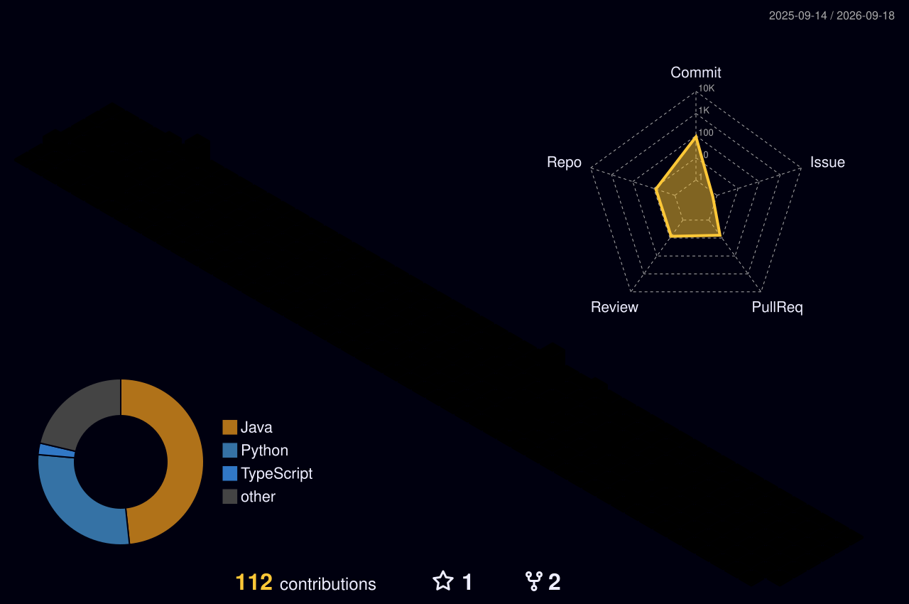

## Contribution Snake

<picture>
  <source media="(prefers-color-scheme: dark)" srcset="https://raw.githubusercontent.com/DawnZYC/DawnZYC/output/github-contribution-grid-snake-dark.svg">
  <source media="(prefers-color-scheme: light)" srcset="https://raw.githubusercontent.com/DawnZYC/DawnZYC/output/github-contribution-grid-snake.svg">
  
</picture>

## 3D Contribution Calendar

## GitHub Metrics

